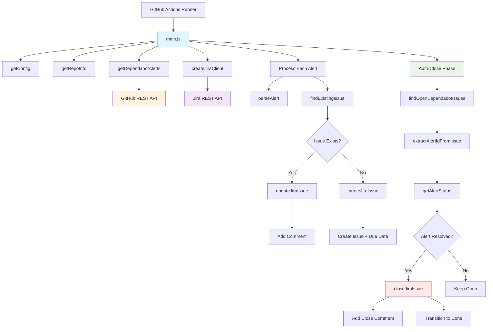

# Developer's Guide: Dependabot Jira Sync Action

This guide explains the internals of how the Dependabot-Jira sync action works,
including architecture, data flow, and how to extend it.

## 🏗️ Architecture Overview



## 📂 Code Structure

```
src/
├── index.js       # Entry point - imports and runs main()
├── main.js        # Core orchestration logic
├── github.js      # GitHub API interactions
└── jira.js        # Jira API interactions + business logic
```

## 🔄 Sync Flow Deep Dive

### 1. **Initialization Phase**

```javascript
// main.js: getConfig()
const config = {
  github: { token },
  jira: {
    url,
    username,
    apiToken,
    projectKey,
    issueType,
    priority,
    labels,
    assignee,
    dueDays
  },
  filters: { severityThreshold, excludeDismissed },
  behavior: { updateExisting, dryRun }
}
```

**Key Points:**

- All inputs are validated and parsed into a structured config object
- Due date configuration is converted to integers
- Boolean inputs are properly handled (GitHub Actions passes strings)

### 2. **GitHub Data Retrieval**

```javascript
// github.js: getDependabotAlerts()
const alerts = await octokit.rest.dependabot.listAlertsForRepo({
  owner,
  repo,
  state: excludeDismissed ? 'open' : 'all',
  per_page: 100
})
```

**Filtering Logic:**

```javascript
const severityLevels = ['low', 'medium', 'high', 'critical']
const minSeverityIndex = severityLevels.indexOf(severityThreshold.toLowerCase())

const filteredAlerts = alerts.filter((alert) => {
  const alertSeverity = alert.security_advisory?.severity?.toLowerCase()
  const alertSeverityIndex = severityLevels.indexOf(alertSeverity)
  return alertSeverityIndex >= minSeverityIndex
})
```

### 3. **Data Transformation**

Each GitHub alert is transformed into a normalized structure:

```javascript
// github.js: parseAlert()
{
  id: alert.number,                    // Unique identifier
  title: advisory.summary,             // Issue summary
  description: advisory.description,   // Detailed description
  severity: advisory.severity,         // critical|high|medium|low
  package: dependency.package.name,    // Package name
  ecosystem: dependency.package.ecosystem, // npm, pip, etc.
  vulnerableVersionRange: vulnerability.vulnerable_version_range,
  firstPatchedVersion: vulnerability.first_patched_version?.identifier,
  cvss: advisory.cvss?.score,         // CVSS score (0-10)
  cveId: advisory.cve_id,             // CVE identifier
  ghsaId: advisory.ghsa_id,           // GitHub Security Advisory ID
  url: alert.html_url,                // Link to GitHub alert
  createdAt: alert.created_at,        // Timestamps
  updatedAt: alert.updated_at,
  state: alert.state,                 // open|dismissed|fixed
  dismissedAt: alert.dismissed_at,    // Dismissal info
  dismissedReason: alert.dismissed_reason,
  dismissedComment: alert.dismissed_comment
}
```

### 4. **Jira Issue Detection**

```javascript
// jira.js: findExistingIssue()
const jql = `project = ${projectKey} AND summary ~ "Dependabot Alert #${alertId}"`
```

**Search Strategy:**

- Uses JQL (Jira Query Language) to find issues
- Searches by summary pattern: `"Dependabot Alert #42"`
- Returns first match or `null`
- Gracefully handles search errors

### 5. **Due Date Calculation**

This is the **key differentiator** of our action:

```javascript
// jira.js: calculateDueDate()
const daysMap = {
  critical: dueDaysConfig.critical || 1, // Default: 1 day
  high: dueDaysConfig.high || 7, // Default: 7 days
  medium: dueDaysConfig.medium || 30, // Default: 30 days
  low: dueDaysConfig.low || 90 // Default: 90 days
}

const days = daysMap[severity] || daysMap.medium
const baseDate = createdAt ? new Date(createdAt) : new Date()
const dueDate = new Date(baseDate)
dueDate.setDate(dueDate.getDate() + days)
return dueDate.toISOString().split('T')[0] // YYYY-MM-DD format
```

### 6. **Jira Issue Creation**

```javascript
// jira.js: createJiraIssue()
const issueData = {
  fields: {
    project: { key: projectKey },
    summary: `Dependabot Alert #${alert.id}: ${alert.title}`,
    description: formatDescription(alert),
    issuetype: { name: issueType },
    priority: { name: priority },
    duedate: calculateDueDate(alert.severity, dueDaysConfig, alert.createdAt),
    labels: parseLabels(labels),
    assignee: assignee ? { name: assignee } : undefined
  }
}
```

**Description Template:**

```markdown
_Dependabot Security Alert #42_

_Package:_ lodash _Ecosystem:_ npm  
_Severity:_ CRITICAL _Vulnerable Version Range:_ < 4.17.12 _First Patched
Version:_ 4.17.12

_Description:_ Prototype pollution vulnerability allows...

_CVSS Score:_ 9.8 _CVE ID:_ CVE-2019-10744 _GHSA ID:_ GHSA-jf85-cpcp-j695

_GitHub Alert URL:_ https://github.com/company/repo/security/dependabot/42

---

_This issue was automatically created by the Dependabot Jira Sync action._
```

### 7. **Update Handling**

When an existing issue is found:

```javascript
// jira.js: updateJiraIssue()
const comment = `
*Dependabot Alert Updated*

The Dependabot alert #${alert.id} has been updated.

*Current Status:* ${alert.state}
*Last Updated:* ${new Date(alert.updatedAt).toLocaleString()}

${alert.dismissedAt ? `*Dismissed At:* ${new Date(alert.dismissedAt).toLocaleString()}` : ''}
${alert.dismissedReason ? `*Dismissed Reason:* ${alert.dismissedReason}` : ''}
${alert.dismissedComment ? `*Dismissed Comment:* ${alert.dismissedComment}` : ''}
`

await jiraClient.post(`/issue/${issueKey}/comment`, { body: comment })
```

### 8. **Auto-Close Functionality**

After processing all new/updated alerts, the action performs lifecycle
management:

```javascript
// main.js: Auto-close phase
if (config.behavior.autoCloseResolved) {
  const openIssues = await findOpenDependabotIssues(jiraClient, projectKey)

  for (const issue of openIssues) {
    const alertId = extractAlertIdFromIssue(issue)
    if (alertId) {
      const status = await getAlertStatus(owner, repo, alertId)
      if (['fixed', 'dismissed', 'not_found'].includes(status)) {
        await closeJiraIssue(jiraClient, issue.key, transition, comment)
      }
    }
  }
}
```

**Key Functions:**

1. **`findOpenDependabotIssues()`** - JQL search for open Dependabot issues:

   ```javascript
   const jql = `project = "${projectKey}" AND labels = "dependabot" AND status != "Done" AND status != "Resolved" AND status != "Closed"`
   ```

2. **`extractAlertIdFromIssue()`** - Extract alert ID from issue:

   ```javascript
   // From title: "Dependabot Alert #42: ..."
   const titleMatch = issue.summary?.match(/Dependabot Alert #(\d+)/)
   // From description: "Alert ID: 42"
   const descMatch = issue.description?.match(/Alert ID:\s*(\d+)/)
   ```

3. **`getAlertStatus()`** - Check current alert status in GitHub:

   ```javascript
   const response = await octokit.rest.dependabot.getAlert({
     owner,
     repo,
     alert_number: parseInt(alertId)
   })
   return response.data.state // 'open'|'fixed'|'dismissed'
   ```

4. **`closeJiraIssue()`** - Close with workflow transition:

   ```javascript
   // Get available transitions
   const transitions = await jiraClient.get(`/issue/${issueKey}/transitions`)
   const transition = transitions.data.transitions.find(
     (t) => t.name.toLowerCase() === transitionName.toLowerCase()
   )

   // Perform transition
   await jiraClient.post(`/issue/${issueKey}/transitions`, {
     transition: { id: transition.id }
   })
   ```

## 🔧 API Integration Details

### GitHub API Integration

**Authentication:**

```javascript
const octokit = getOctokit(token) // Uses @actions/github
```

**Rate Limits:**

- Default `GITHUB_TOKEN`: 1,000 requests/hour
- Personal Access Token: 5,000 requests/hour
- Enterprise: Higher limits

**Pagination:**

```javascript
// Currently fetches first 100 alerts
// TODO: Add pagination for repos with >100 alerts
per_page: 100
```

### Jira API Integration

**Authentication:**

```javascript
const client = axios.create({
  baseURL: `${jiraUrl}/rest/api/2`,
  auth: {
    username, // Email address
    password: apiToken // API token (not password!)
  }
})
```

**Error Handling:**

```javascript
client.interceptors.response.use(
  (response) => response,
  (error) => {
    const message =
      error.response?.data?.errorMessages?.join(', ') ||
      error.response?.data?.message ||
      error.message
    throw new Error(`Jira API Error: ${message}`)
  }
)
```

## 🧪 Testing Strategy

### Current Test Coverage

🎯 **81.01% overall code coverage** with 54 comprehensive tests:

- **Jira module**: 95.18% coverage (31 tests)
- **GitHub module**: 77.46% coverage (16 tests)
- **Main module**: 69.87% coverage (6 tests)

### Test Structure by Module

#### GitHub API Tests (`__tests__/github.test.js`)

- `getRepoInfo` - Repository parsing
- `getDependabotAlerts` - Alert fetching and filtering
- `parseAlert` - Alert data transformation
- `getAlertStatus` - **New**: Alert status checking for auto-close

#### Jira API Tests (`__tests__/jira.test.js`)

- `createJiraClient` - Client configuration
- `calculateDueDate` - Severity-based due dates
- `findExistingIssue` - Issue search and matching
- `createJiraIssue` - Issue creation with all fields
- `updateJiraIssue` - Issue updates and comments
- `findOpenDependabotIssues` - **New**: Auto-close issue discovery
- `extractAlertIdFromIssue` - **New**: Alert ID extraction from issues
- `closeJiraIssue` - **New**: Auto-close workflow with transitions

#### Integration Tests (`__tests__/main.test.js`)

- End-to-end workflow scenarios
- Error handling and validation
- Dry run mode behavior

### Unit Test Structure

```javascript
// __tests__/github.test.js
describe('GitHub API Functions', () => {
  describe('getDependabotAlerts', () => {
    it('should fetch alerts and filter by severity threshold', async () => {
      // Mock GitHub API response
      mockOctokit.rest.dependabot.listAlertsForRepo.mockResolvedValue({
        data: mockAlerts
      })

      const result = await getDependabotAlerts('token', 'owner', 'repo', {
        severityThreshold: 'medium'
      })

      // Verify API call
      expect(
        mockOctokit.rest.dependabot.listAlertsForRepo
      ).toHaveBeenCalledWith({
        owner: 'owner',
        repo: 'repo',
        state: 'open',
        per_page: 100
      })

      // Verify filtering
      expect(result).toHaveLength(1)
      expect(result[0].security_advisory.severity).toBe('high')
    })
  })
})
```

### Mock Strategies

1. **API Clients:** Mock `axios` and `@actions/github`
2. **Date/Time:** Mock `Date` constructor for deterministic tests
3. **Environment:** Mock `process.env.GITHUB_REPOSITORY`
4. **Core Functions:** Mock `@actions/core` for input/output testing

## 🔄 State Management

### Alert State Tracking

The action tracks alert state through:

1. **GitHub Alert State:** `open` | `dismissed` | `fixed`
2. **Jira Issue Status:** Depends on your Jira configuration
3. **Sync State:** Tracked via issue summary pattern

### Idempotency

The action is **idempotent** - running it multiple times produces the same
result:

- ✅ Won't create duplicate issues (searches first)
- ✅ Will add update comments for changed alerts
- ✅ Respects `update-existing` configuration
- ✅ Dry-run mode for safe testing

## 🚀 Extending the Action

### Adding New Inputs

1. **Update `action.yml`:**

```yaml
inputs:
  my-new-input:
    description: 'Description of new input'
    required: false
    default: 'default-value'
```

2. **Update `getConfig()` in `main.js`:**

```javascript
const config = {
  // ... existing config
  myNewFeature: {
    enabled: core.getBooleanInput('my-new-input')
  }
}
```

3. **Add tests in `__tests__/main.test.js`:**

```javascript
mockCore.getBooleanInput.mockImplementation((name) => {
  if (name === 'my-new-input') return true
  return false
})
```

### Adding New Jira Fields

```javascript
// In createJiraIssue()
const issueData = {
  fields: {
    // ... existing fields
    customfield_10001: alert.cvss, // Custom CVSS field
    components: [{ name: 'Security' }], // Component
    fixVersions: [{ name: 'Next Release' }] // Fix version
  }
}
```

### Adding Status Transitions

```javascript
// New function in jira.js
export async function transitionJiraIssue(
  jiraClient,
  issueKey,
  transitionName,
  dryRun = false
) {
  if (dryRun) {
    core.info(`[DRY RUN] Would transition ${issueKey} to ${transitionName}`)
    return
  }

  // Get available transitions
  const transitions = await jiraClient.get(`/issue/${issueKey}/transitions`)
  const transition = transitions.data.transitions.find(
    (t) => t.name === transitionName
  )

  if (!transition) {
    throw new Error(
      `Transition "${transitionName}" not available for ${issueKey}`
    )
  }

  // Execute transition
  await jiraClient.post(`/issue/${issueKey}/transitions`, {
    transition: { id: transition.id }
  })

  core.info(`Transitioned ${issueKey} to ${transitionName}`)
}
```

## 🔍 Debugging

### Logging Levels

The action uses `@actions/core` logging:

```javascript
core.debug('Detailed debug info') // Only with ACTIONS_STEP_DEBUG=true
core.info('General information') // Always shown
core.warning('Non-fatal warnings') // Yellow in UI
core.error('Error occurred') // Red in UI, doesn't fail action
core.setFailed('Fatal error') // Red in UI, fails action
```

### Common Issues

1. **GitHub Token Permissions:**

   ```
   Error: Resource not accessible by integration
   ```

   - Solution: Use PAT token or enable security-events permission

2. **Jira Authentication:**

   ```
   Jira API Error: Unauthorized (401)
   ```

   - Solution: Verify API token and email are correct

3. **Jira Project Configuration:**

   ```
   Field 'assignee' cannot be set. It is not on the appropriate screen
   ```

   - Solution: Remove assignee or update Jira field configuration

### Dry Run Mode

Always test with `dry-run: true` first:

```yaml
- name: Test Sync (Dry Run)
  uses: ./
  with:
    dry-run: 'true'
    # ... other inputs
```

This will show exactly what the action would do without making changes.

## 📊 Performance Considerations

### Rate Limiting

- **GitHub API:** 1,000-5,000 requests/hour
- **Jira API:** Usually much higher limits

### Optimization Strategies

1. **Pagination:** For repos with >100 alerts
2. **Caching:** Store issue mappings between runs
3. **Batch Operations:** Group Jira API calls
4. **Filtering:** Process only changed alerts

### Monitoring

Track these metrics:

- Alerts processed per run
- Issues created vs updated
- API call counts
- Execution time
- Error rates

## 🎯 Best Practices

### Configuration

1. **Use Repository Secrets** for sensitive data
2. **Start with `dry-run: true`** for testing
3. **Configure appropriate severity thresholds**
4. **Set realistic due dates** based on team capacity

### Operational

1. **Run on a schedule** (e.g., every 6 hours)
2. **Monitor action logs** for errors
3. **Review Jira issues** regularly
4. **Update dependencies** of the action itself

### Security

1. **Rotate API tokens** regularly
2. **Use minimal required permissions**
3. **Audit action usage** in organization
4. **Keep action updated** for security patches

---

## 🤝 Contributing

When contributing to this action:

1. **Add tests** for new functionality
2. **Update documentation** (this guide + README)
3. **Test in dry-run mode** first
4. **Follow existing code patterns**
5. **Add appropriate logging**

For questions or issues, see the main [README.md](./README.md) or open an issue
on GitHub.

---

_This developer guide covers the internals of v1.0.0. For user documentation,
see [README.md](./README.md)._
